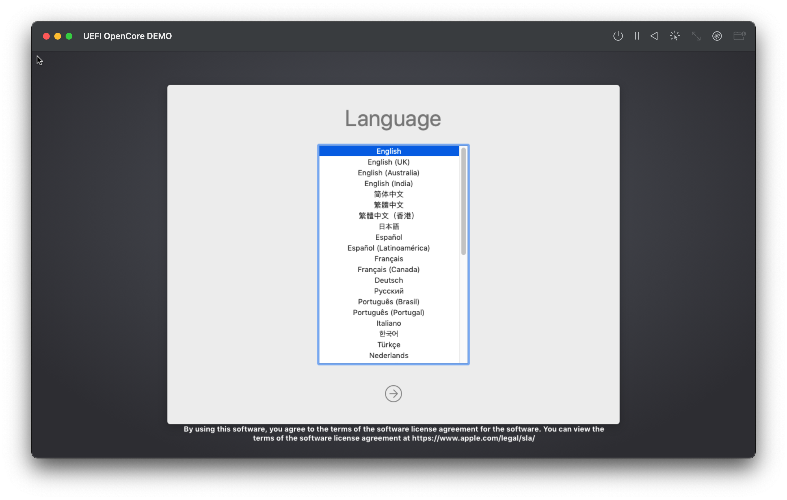

Recently I purchased an M1 equipped 13" MacBook Pro. Overall the machine has been absolutely amazing however I have 1 big issue transitioning from my old Intel Hackintosh:

* Missing macOS guest VMs

While its clear that both [Parallels](https://www.parallels.com/) and [VMWare](https://www.vmware.com) will support Apple Silicon with macOS guests in the future, the question is when. Additionally, it's also unclear if we'll ever get x86 emulation from them or if its strictly ARM64 only. A bit of a shame especially as I do frequently boot old macOS VMs versions to check for bugs.

To get around this, I wanted to see if our good ol friend QEMU can help us out and do full x86 emulation.

For today's experiment, we'll try and see if we can get to the macOS recovery environment with a vanilla macOS BaseSystem.

## Getting started

To start, we'll need a few things:

* [UTM](https://github.com/utmapp/UTM/releases)
  * A very nice wrapper for QEMU in macOS, additionally also supports iOS
* [OpenCore Image](../Binaries/EFI.img.zip)
  * Our bootloader to help launch macOS
  * [Source](https://github.com/acidanthera/OpenCorePkg/releases)
* [OVMF Binary](https://www.kraxel.org/repos/jenkins/edk2/)
  * Our UEFI image for QEMU
    * Note we want `edk2.git-ovmf-x64` specifically
  * [Source](https://github.com/tianocore/edk2/tree/master/OvmfPkg)
* macOS Image
  * See [macrecovery](https://github.com/acidanthera/OpenCorePkg/tree/master/Utilities/macrecovery) in OpenCorePkg on how to download from Apple's servers
    * This should provide you with a BaseSystem/RestoreImage.dmg for use to play with

Now open up the UTM.dmg and add UTM.app to the `Applications/` folder.

Next, download OVMF from the [Qemu firmware repo](https://www.kraxel.org/repos/jenkins/edk2/) and run the following:

```sh
cd ~/Downloads
# Extract the .rpm
# Ensure filename is correct to yours
tar -xf edk2.git-ovmf-x64-0-20201222.1538.g014b9850f2.noarch.rpm
# Next rename and move the file into UTM
cp usr/share/edk2.git/ovmf-x64/OVMF_CODE-pure-efi.fd /Applications/UTM.app/Contents/Resources/qemu/OVMF.bin
```

From here, we can open UTM.app and get started:


We'll first want to make a fresh VM, here I'll list a few of the required settings to boot:

| System | QEMU | Drives |
| :--- | :--- | :--- |
|  |  |  |

* **System**:
  * Architecture: `x86_64`
  * System: `Standard PC (Q35 + ICH9, 2009)`
  * Memory: `4096MB`
* **QEMU**:
  * `-bios`
  * `/Applications/UTM.app/Contents/Resources/qemu/OVMF.bin`
  * `-cpu`
  * `Penryn,+ssse3,+sse4.1,+sse4.2`
* **Drives**:
  * EFI.img:
    * Image Type: `Disk Image`
	* Interface: `VirtIO`
  * BaseSystem.dmg:
    * Image Type: `Disk Image`
	* Interface: `USB`

Once these are all done, we can now boot our VM!

## Booting the VM

| 1. OVMF Start | 2. OpenCore Picker | 3. macOS Kernel Starts |
| :--- | :--- | :--- |
|  |  |  |

The boot process is slow however, I mean *very* slow. However after ***17min*** we finally reach macOS's recovery screen!:



The OS is unusable to say the least, and unfortunately won't get much better even with tinkering. However the fact QEMU is able to emulate an Intel Penryn PC so well is quite remarkable, and OpenCore has made this much easier to build and boot.
