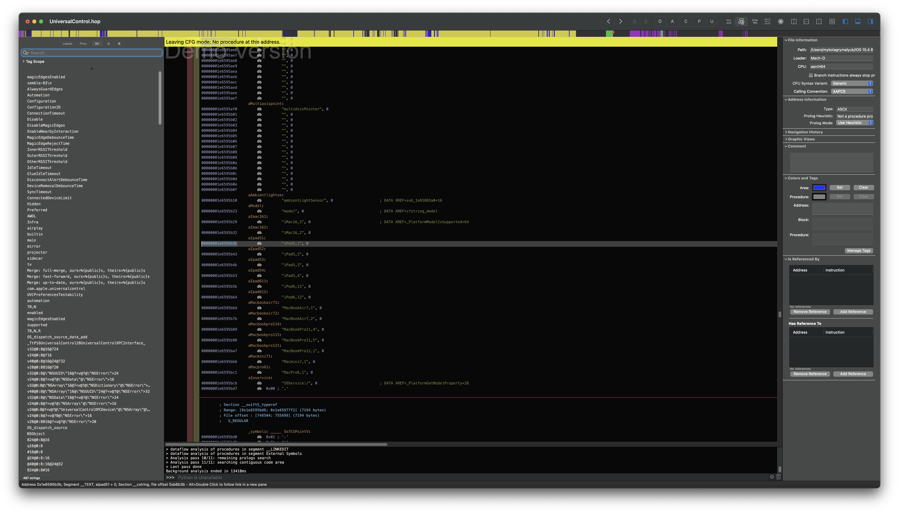

With macOS 12.3 Beta 1, Apple re-introduced support for Universal Control for both Macs and iPads. However, with this re-introduction, we can see Universal Control seems to have gone through some overhauling likely explaining the delayed rollout.

## New macOS Blacklists

Shortly after installing macOS 12.3 Beta 1 on my iMac15,1, I noticed that the Universal Control settings reappeared in Display Settings:


This was a bit strange as previously Apple had blocked this model from working. After a bit of digging, I found the resurrected Universal Control.app in `/System/Library/CoreServices`


After throwing it in the disassembler, I found that the blacklist was completely rewritten. The same logic of not supporting H.264 Macs was used, but now only limited to models natively running Monterey:

```c
// iMac16,1 iMac16,2
// iPad5,1 iPad5,2 iPad5,3 iPad5,4 iPad6,11 iPad6,12
// MacBookAir7,1 MacBookAir7,2
// MacBookPro11,4 MacBookPro11,5 MacBookPro12,1
// Macmini7,1 MacPro6,1
0x69, 0x4D, 0x61, 0x63, 0x31, 0x36, 0x2C, 0x31, 0x00,
0x69, 0x4D, 0x61, 0x63, 0x31, 0x36, 0x2C, 0x32, 0x00,
0x69, 0x50, 0x61, 0x64, 0x35, 0x2C, 0x31, 0x00,
0x69, 0x50, 0x61, 0x64, 0x35, 0x2C, 0x32, 0x00,
0x69, 0x50, 0x61, 0x64, 0x35, 0x2C, 0x33, 0x00,
0x69, 0x50, 0x61, 0x64, 0x35, 0x2C, 0x34, 0x00,
0x69, 0x50, 0x61, 0x64, 0x36, 0x2C, 0x31, 0x31, 0x00,
0x69, 0x50, 0x61, 0x64, 0x36, 0x2C, 0x31, 0x32, 0x00,
0x4D, 0x61, 0x63, 0x42, 0x6F, 0x6F, 0x6B, 0x41, 0x69, 0x72, 0x37, 0x2C, 0x31, 0x00,
0x4D, 0x61, 0x63, 0x42, 0x6F, 0x6F, 0x6B, 0x41, 0x69, 0x72, 0x37, 0x2C, 0x32, 0x00,
0x4D, 0x61, 0x63, 0x42, 0x6F, 0x6F, 0x6B, 0x50, 0x72, 0x6F, 0x31, 0x31, 0x2C, 0x34, 0x00,
0x4D, 0x61, 0x63, 0x42, 0x6F, 0x6F, 0x6B, 0x50, 0x72, 0x6F, 0x31, 0x31, 0x2C, 0x35, 0x00,
0x4D, 0x61, 0x63, 0x42, 0x6F, 0x6F, 0x6B, 0x50, 0x72, 0x6F, 0x31, 0x32, 0x2C, 0x31, 0x00,
0x4D, 0x61, 0x63, 0x6D, 0x69, 0x6E, 0x69, 0x37, 0x2C, 0x31, 0x00,
0x4D, 0x61, 0x63, 0x50, 0x72, 0x6F, 0x36, 0x2C, 0x31
```

This made my work with [OpenCore Legacy Patcher](https://github.com/dortania/OpenCore-Legacy-Patcher) a lot easier as all the models we support got Universal Control out of the box! And for [FeatureUnlock](https://github.com/acidanthera/FeatureUnlock), it was just another patch I needed to add.

Note that this exact blacklist is also found under `/System/Library/PrivateFrameworks/UniversalControl.framework`, however, cached within the dyld itself. For [FeatureUnlock](https://github.com/acidanthera/FeatureUnlock), dyld patching is already supported.

## iOS-Side Blacklists

I was curious if Apple had added additional checks in iPadOS, so I downloaded an iOS 15.4 Beta 1 IPSW from Apple and extracted the dyld (using the [dsc_extractor](https://twitter.com/zhuowei/status/1402137181502722051)):

```sh
mv iPadPro_12.9_15.4_19E5209h_Restore.ipsw iPadPro_12.9_15.4_19E5209h_Restore.zip
unzip iPadPro_12.9_15.4_19E5209h_Restore.ipsw
# look for 5GB~ disk image
hdiutil attach ./018-95413-019.dmg
./dsc_extractor /Volumes/SkyEchoSeed19E5209h.J98aJ99aDeveloperOS/System/Library/Caches/com.apple.dyld/dyld_shared_cache_arm64 ./dyld_dump_folder
```

From here, I delved into `./dyld_dump_folder/System/Library/PrivateFrameworks/UniversalControl.framework/UniversalControl` and threw it in Hopper. Here we can see that Apple unfortunately still blocks older iPad models within iPadOS as well as the Mac models:

| Model Blacklists | Model Detection |
| :--- | :--- |
|  |  |

However the Mac model blocks are done via checking the IOService model, so iPadOS is agnostic to the Mac being used.

## Updating FeatureUnlock

Updating FeatureUnlock was fairly straightforward, however, I hit one of the stranger issues with Universal Control.app pathing. Apparently, due to localization, a space is added in the app name but is not in the path itself:


After this mini headache, FeatureUnlock was updated to work with these unsupported models:


## Closing Thoughts

While I cannot comment on the experience of Universal Control on older iPad models, usage on older Macs has been great as reported by our users. While I know that the main reason for implementing these blacklists is validation, I do find it a bit frustrating that there are no official ways to enable these features by the end-user. However, I suppose that this keeps me busy, growing the [OpenCore Legacy Patcher](https://github.com/dortania/OpenCore-Legacy-Patcher) userbase. ;p