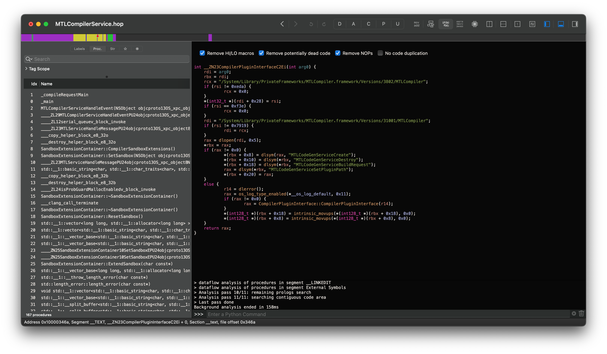

With the release of macOS Ventura, Apple dropped all Metal 1 GPUs as well as some Metal 2 ones (namely Intel Skylake and AMD GCN 1-3). In today's post, we'll be going over how Apple broke these GPUs and what this means for the future of legacy Metal systems.

* [Catching up with the past: Big Sur and Monterey](#catching-up-with-the-past-big-sur-and-monterey)
  * [Battle against on-disk binaries](#battle-against-on-disk-binaries)
  * [First removal of Metal graphics drivers](#first-removal-of-metal-graphics-drivers)
* [Back to the present: Ventura and legacy Metal](#back-to-the-present-ventura-and-legacy-metal)
  * [Dropped GPUs](#dropped-gpus)
  * [Dropped Compilers](#dropped-compilers)
* [Initial Trials: Testing the basics](#initial-trials-testing-the-basics)
  * [Running stock, re-add missing Acceleration Binaries](#running-stock-re-add-missing-acceleration-binaries)
  * [Downgrading the Metal Stack](#downgrading-the-metal-stack)
    * [Challenge 1: Metal Versioning](#challenge-1-metal-versioning)
    * [Challenge 2: Shimming](#challenge-2-shimming)
    * [Challenge 3: Testing](#challenge-3-testing-scession---stage-1)
      * [Test 1: 12.4 Metal.framework](#test-1-124-metalframework)
      * [Test 2: 11.4 Metal.framework](#test-2-114-metalframework)
      * [Test 3: 11.0 Beta 6 Metal.framework](#test-3-110-beta-6-metalframework)
    * [Challenge 4: Resolving Sandboxing Errors](#challenge-4-resolving-sandboxing-errors)
    * [Challenge 5: Retesting](#challenge-5-retesting)
      * [Test 1: 12.4 Metal.framework (Try 2)](#test-1-124-metalframework-try-2)

# Catching up with the past: Big Sur and Monterey

Before we dive too much into Ventura's mess, we should first discuss some of the changes and challenges presented from the older OSes (ie. Big Sur and Monterey):

* [Battle against on-disk binaries](#battle-against-on-disk-binaries)
* [First removal of Metal graphics drivers](#first-removal-of-metal-graphics-drivers)

## Battle against on-disk binaries

With the very first developer beta of macOS Big Sur, we see that Apple's moved away from on-disk binaries towards a massive binary called the `dyld_shared_cache`. This giant binary, located at `/System/Library/dyld`, hosts most of the frameworks in macOS  and interlinks them to aid with function calls and try to speed up many of the core functions in macOS.

However because of this, we no longer have framework binaries that we can use to downgrade in the future.

Up until after [11.0 Beta 6 (20A5364e)](https://archive.org/details/install-assistant-11.0-dp-6), Apple hadn't merged the graphics stack into the dyld just yet. Thus we're able to extract some binaries from this OS build, namely:

* MTLCompiler.framework
  * Only 3802 and 3902 are present, 31001 was never on-disk
* GPUCompiler.framework
  * Same 3802 and 3902, no 31001
* Metal and OpenGL .bundles (from `/System/Library/Extensions`, GPU architecture specific)

While this seems like the last build we can grab binaries, we actually have an extra work-around. Specifically macOS has a disk image called the RAM disk (SURamdisk). This is used during OS installs/updates, and on-disk binaries are available! However there's a catch, most of the frameworks are missing, and only a select few are present that are needed for the OS update stage.

* Currently up-to macOS Ventura, these RAM disks are still present and can be extracted from OS installers relatively easily inside of SharedSupport.dmg
  * `/Volumes/Shared Support/com_apple_MobileAsset_MacSoftwareUpdate/{random hex string, around 11GB~}.zip`:
    * `/AssetData/usr/standalone/update/ramdisk/x86_64SURamDisk.dmg`

Main binaries to extract from RAM disk would be `Metal.framework` and potentially `IOAccelerator.framework` and `CoreDisplay.framework` (depending on whether they affect us down the line)
* Regarding Metal.framework, keep in mind that `MTLCompilerService.xpc` is present on-disk and not in the RAM disk.

## First removal of Metal graphics drivers

With macOS Monterey, Apple first removed the Ivy Bridge graphics stack and later on the Nvidia Kepler stack with Beta 7. Here this is our first time experiencing perfectly functional drivers be removed from the OS.

With Ivy Bridge, the process was fairly straight forward once the binaries were acquired:

```py
"/System/Library/Extensions": {
	"AppleIntelHD4000GraphicsGLDriver.bundle":  "11.0 Beta 6",
	"AppleIntelHD4000GraphicsMTLDriver.bundle": "11.0 Beta 6",
	"AppleIntelHD4000GraphicsVADriver.bundle":  "11.3 Beta 1",
	"AppleIntelFramebufferCapri.kext":          "11.4",
	"AppleIntelHD4000Graphics.kext":            "11.4",
	"AppleIntelIVBVA.bundle":                   "11.4",
	"AppleIntelGraphicsShared.bundle":          "11.4", # libIGIL-Metal.dylib pulled from 11.0 Beta 6
},
```

* .kexts were able to be pulled from the root volume in newer OSes easily, however most .bundles were not for the most part:
  * VA and Shared bundles are still present on root, though verify all binaries are accounted for.
  * Usage of 11.3 Beta 1 is simply due to DRM strangness with Ivy Bridge, unrelated to actual graphics acceleration

Thankfully with Monterey, no important compilers were dropped so only the GPU specific graphics stack needed some work.

An additional note with Monterey is that this is the first time we've lost a Metal compiler, and actually didn't even notice from a patcher perspective. Specifically, the 3902 compiler inside of MTLCompiler.framework and GPUCompiler.framework was removed and the remaining 2 compilers are 3802 and 31001.

* We assume 3902 was absorbed into 31001, however this currently speculation. More research needed.

# Back to the present: Ventura and legacy Metal

Now that we've seen some of the general issues with older OSes, let's take a look at the major changes in Ventura.

* [Dropped GPUs](#dropped-gpus)
* [Dropped Compilers](#dropped-compilers)

## Dropped GPUs

With Ventura, the following GPUs have been removed:

* Intel Haswell, Broadwell and Skylake
* AMD GCN 1, 2 and 3

What makes this set of GPUs a bit interesting is that only Haswell and Broadwell are Metal 1 GPUs, all of AMD is Metal 2 as well as Skylake. Will be curious to see whether this has an effect down the line.

## Dropped Compilers

And the area we're most concerned about is the dropped compilers:

* 3802 MTLCompiler.framework
* 3802 GPUCompiler.framework
  * Present in 13.0 Beta 1, removed in Beta 2

Currently we're unsure whether the removal of these compilers affects us, namely because Metal 2 GPUs do not seem to invoke the 3802 compilers in Monterey. Only Metal 1 GPUs will occasionally use 3802, but majority of the time rely on 31001.

* You can see which compiler is being use by monitoring `MTLCompiler` in console, and expanding on the path (click the header above `Subsystem`)
* Back with the introduction of Monterey, Apple seemed to have merged the 3902 compiler into 31001. Unknown if whether the same happened with 3802, or if it was truly outright removed.

In addition to this, Apple has deprecated the `MTLGPUFamilyMac1` class from MTLGPUFamily in Ventura:

* [MTLGPUFamilyMac1](https://developer.apple.com/documentation/metal/mtlgpufamily/mtlgpufamilymac1?language=objc)
  * macOS 10.15–13.0 Deprecated
  * Note: Deprecation does not mean removal


# Initial Trials: Testing the basics


Now that we've seen the above issues, we have a couple tests that can be run:

* [Running stock, re-add missing Acceleration Binaries](#running-stock-re-add-missing-acceleration-binaries)
* [Downgrading the Metal Stack](#downgrading-the-metal-stack)


## Running stock, re-add missing Acceleration Binaries

For our first test, we'll grab our trusty Macmini7,1 to perform these tests. The unit is as follows:

```
Model:  Macmini7,1 - 2014 Mac mini
CPU:    Haswell Dual Core
GPU:    Iris 5100 (Metal 1)
```

From here, we'll install the following binaries:

```py
"/System/Library/Extensions": {
	"AppleIntelHD5000GraphicsGLDriver.bundle":  "11.0 Beta 6",
	"AppleIntelHD5000GraphicsMTLDriver.bundle": "11.0 Beta 6",
	"AppleIntelHD5000GraphicsVADriver.bundle":  "11.4",
	"AppleIntelFramebufferAzul.kext":           "11.4",
	"AppleIntelHD5000Graphics.kext":            "11.4",
	"AppleIntelHSWVA.bundle":                   "11.4",
	"AppleIntelGraphicsShared.bundle":          "11.4", # libIGIL-Metal.dylib pulled from 11.0 Beta 6
},
```

* Reasoning for 11.4 binaries over 12.4 is due to avoiding a mismatched CoreDisplay error. If the .bundle and .kext aren't close enough, they will fail to init correctly
  * Additionally, we know 11.4's binaries are functional thanks to Ivy Bridge in Monterey, thus we'll try to match that closely

From this testing, we're able to reboot and get to userspace. However when SkyLight tries to render with `MetalShader()`, `MTLCompilerService` starts to error out:

* [WindowServer Crash](https://pastebin.com/52zmuqMt)
* [MTLCompilerService Crash](https://pastebin.com/jUT8cijj)

```
Thread 0 Crashed::  Dispatch queue: com.apple.main-thread
0   libsystem_kernel.dylib        	    0x7ff8065f437e __pthread_kill + 10
1   libsystem_pthread.dylib       	    0x7ff80662c20f pthread_kill + 263
2   libsystem_c.dylib             	    0x7ff806575cb8 abort + 123
3   SkyLight                      	    0x7ff80b5d3c94 MetalShader::CopyPipelineState(MetalContext*, bool, bool) + 3228
4   SkyLight                      	    0x7ff80b72e90a MetalTiledBacking::RenderToDestination(MetalContext*, WSCompositeSourceLayer*, WSCompositeDestination*) + 638
5   SkyLight                      	    0x7ff80b739335 MetalCompositeLayers + 41
6   SkyLight                      	    0x7ff80b738da6 CompositorMetal::composite(WSCompositeSourceLayer*, WSCompositeDestination*, bool, bool) + 326
7   SkyLight                      	    0x7ff80b733911 CompositorMetal::CompositeLayersToDestination(WSCompositeSourceLayer*, WSCompositeDestination*, unsigned long long) + 239
8   SkyLight                      	    0x7ff80b5fdf8a WS::Displays::CDDisplay::render_update(WS::Displays::Update&, Compositor*, unsigned int, WSCompositeSourceLayer*) + 876
9   SkyLight                      	    0x7ff80b69ce88 WS::Updater::UpdateDisplays(CGXConnection*, bool) + 19176
10  SkyLight                      	    0x7ff80b68e616 update_display_callback(void*, double) + 1644
11  SkyLight                      	    0x7ff80b70adbe run_timer_pass + 502
12  SkyLight                      	    0x7ff80b70aed5 non_coalesced_timer_handler + 16
13  SkyLight                      	    0x7ff80b747a87 post_port_data + 250
14  SkyLight                      	    0x7ff80b747724 CGXRunOneServicesPass + 1672
15  SkyLight                      	    0x7ff80b748153 server_loop + 91
16  SkyLight                      	    0x7ff80b747fb3 SLXServer + 1233
17  WindowServer                  	       0x10d85848c 0x10d855000 + 13452
18  dyld                          	    0x7ffb21462105 start + 2325
```

From this, we're not able to make out any legitimate errors outside of `MTLConnectionCtx::MTLConnectionCtx()` from MTLCompilerService's crash log. If we follow this code:

```c++
// Metal.framework/Versions/A/XPCServices/MTLCompilerService.xpc/Contents/MacOS/MTLCompilerService
   MTLConnectionCtx::MTLConnectionCtx()               -> __ZN16MTLConnectionCtxC2Ei()
   __ZN16MTLConnectionCtxC2Ei                         -> CompilerPluginInterface::CompilerPluginInterface()
   CompilerPluginInterface::CompilerPluginInterface() -> __ZN23CompilerPluginInterfaceC2Ei()
```

Once we reach `__ZN23CompilerPluginInterfaceC2Ei()`, we see where we might find out first issue. Specifically, the MTLCompiler binaries are hard coded into this function.

Thus even if we re-add the 3802 compilers by themselves, they will still do nothing as `CompilerPluginInterface()` will only ever use the 31001 variant. So is the forced usage of 31001 the reason we're having issues? Time to test!

* Note: Both the XPC service and framework share this exact same code block, so ensure to downgrade them together.


| Ventura 13.0 Beta 2 Function | Monterey 12.4 Function |
| :--- | :--- |
|  |  |


## Downgrading the Metal Stack

Now that we've seen our initial erroring, we can try to re-add the 3802 compilers back into macOS. However this is not a simple task, due to both the age of the 3802 binaries as well as the hard coded logic inside the Metal stack.

For this, we have a few options on Metal downgrading:

- 12.4 Metal.framework
  - Only uses 3802 and 31001 code paths
- 11.0 Beta 6 Metal.framework
  - Closest match to MTLCompiler and GPUCompiler
  - Unfortunately uses 3902 compiler as well
- 11.4/6 Metal.framework
  - Newest Big Sur
  - Unfortunately uses 3902 compiler as well

We'll be testing all 3 combos and commenting on our results. Reminder we'll also be downgrading MTLCompiler.framework and GPUCompiler.framework for all these tests

### Challenge 1: Metal Versioning

So our first challenge is to downgrade Metal.framework. However you cannot do it as-is, instead you'll need to patch the version inside the binary. Otherwise you'll receive this error during boot:

```
ReportCrash: ASI found [SkyLight] (sensitive) 'MTLRenderPipelineState creation failed for device Intel Iris Graphics (100000502).

This typically indicates a Metal compiler failure.
Error from Metal: Error Domain=CompilerError Code=2 "Function UberCompositeFragment has a deployment target (0x00020005) which is incompatible with this OS (0x00020004)." UserInfo={NSLocalizedDescription=Function UberCompositeFragment has a deployment target (0x00020005) which is incompatible with this OS (0x00020004).}
```

The check is implemented inside of Metal.framework, specifically function `validateLanguageAndAIRVersionForFunction()`:

* Credit to [ASentientBot](https://github.com/ASentientBot) for the original finding


This is simply a completion handler, so you can force the binary to return zero as success or we can patch it to report the desired version.

Reference for each version:
```
11.0 Beta 6   0x20003
11.4          0x20003
12.4          0x20004
13.0          0x20005
```

### Challenge 2: Shimming

When downgrading binaries to older versions, you need to keep in mind that other frameworks will be expecting specific functions and such to be available. To help avoid this issue, you can ["shim"](https://en.wikipedia.org/wiki/Shim_(computing)) a binary against the newer version.

The simplest way to resolve this is to use Moraea's Stubber tool:

* [Stubber_tool - 06/20/2022](https://cdn.discordapp.com/attachments/573338611337003018/991830610148605972/Stubber_tool.zip)
  * [Original Source](https://github.com/moraea/non-metal-common), modified by EduCovas for simplicity
  * Developer Note: Stubber only works on dynamic libraries

To use this tool, add the 2 binaries to the Stubber_Tool folder, add the `_current` and `_old` suffix to the appropriate binaries and edit the last line of `BuildWrappers.tool`:

* `_current` represents 13.0's Metal.framework
* `_old` represents the downgraded Metal.framework (ie. 12.4)

```diff
- build "QuartzCore_old" "QuartzCore_current" "/System/Library/Frameworks/QuartzCore.framework/Versions/A/QuartzCore"
+ build "Metal_old" "Metal_current" "/System/Library/Frameworks/Metal.framework/Versions/A/Metal"
```

Once edited, run `BuildWrappers.tool` and you'll have your newly generated binaries in the `Wrapped` directory!

* Note: `BuildWrappers.tool` only works on Intel, it will assert if run on Apple Silicon
* Note 2: You can ignore the `warning`'s generated from the shims

| Directory | Terminal |
| :--- | :--- |
|  |  |

When downgrading, you'll need to use both the Metal and MetalOld.dylib to function correctly. You must use both together.

### Challenge 3: Testing Scession - Stage 1


#### Test 1: 12.4 Metal.framework

With this build, there was zero crashing logged in `/Library/Logs/DiagnosticReports` and WindowServer seemed to have crashed either. Looking at the `log` stream, we see the following:

```
MTLCompilerService: (libsandbox.1.dylib) sandbox compile: invalid data type of path filter; expected pattern, got boolean
```

Full log can be found below:
* [LEGACY-METAL-12_4-TEST.txt](/assets/Challenge-3/LEGACY-METAL-12_4-TEST.txt)

#### Test 2: 11.4 Metal.framework

Moving towards 11.4's Metal.framework, we error out quite early:

```
WindowServer: (MetalOld.dylib) MTLDeviceArrayInitialize()
WindowServer: (MetalOld.dylib) +[MTLIOAccelDevice registerDevices]
WindowServer: (MetalOld.dylib) MTLIOAccelDevice bad MetalPluginClassName property (null)
WindowServer: (MetalOld.dylib) MTLIOAccelDevice fallback to principal class MTLIGAccelDevice
WindowServer: (MetalOld.dylib) +[MTLIOAccelDevice registerDevices]: Zero Metal services found
WindowServer: (MetalOld.dylib) MTLDeviceArrayInitialize(): 1 Metal devices
```

Full log can be found below:
* [LEGACY-METAL-11_4-TEST.txt](/assets/Challenge-3/LEGACY-METAL-11_4-TEST.txt)


#### Test 3: 11.0 Beta 6 Metal.framework


Same situation as Test 1:
```
MTLCompilerService: (libsandbox.1.dylib) sandbox compile: invalid data type of path filter; expected pattern, got boolean
```

Full log can be found below:
* [LEGACY-METAL-11_0_B6-TEST.txt](/assets/Challenge-3/LEGACY-METAL-11_0_B6-TEST.txt)

### Challenge 4: Resolving Sandboxing errors

Seeing the errors we saw in test 1 and 3, we'll need to get past those pesky sandboxing issues. The simplest way is to disable sandboxing for the MTLCompilerService.

The file is located at `/System/Library/Sandbox/Profiles/com.apple.mtlcompilerservice.sb`, and you'll just need to replace the contents of the file with the following:

```
(version 1)

(allow default)
```

* Credit to [flagers](https://github.com/flagersgit) for original finding

Once the file is replaced, we'll get much further in the process!

### Challenge 5: Retesting

Now that sandbox is not longer a concern, we can run our tests again:


#### Test 1: 12.4 Metal.framework (Try 2)

Here we now error out with the MetalPerformanceShaders.framework. We see specifically `MPSDevice::GetMPSLibrary_DoNoUse()` erroring out:

```
WindowServer: (CoreFoundation) -[MTLHeapDescriptorInternal setProtectionOptions:]: unrecognized selector sent to instance 0x6000030a17b0
WindowServer: (CoreFoundation) *** Terminating app due to uncaught exception 'NSInvalidArgumentException', reason: '-[MTLHeapDescriptorInternal setProtectionOptions:]: unrecognized selector sent to instance 0x6000030a17b0'
*** First throw call stack:
(
	0   CoreFoundation                      0x00007ff814dbae2b __exceptionPreprocess + 242
	1   libobjc.A.dylib                     0x00007ff8149a1135 objc_exception_throw + 48
	2   CoreFoundation                      0x00007ff814e4f9ab -[NSObject(NSObject) __retain_OA] + 0
	3   CoreFoundation                      0x00007ff814d2569b ___forwarding___ + 1324
	4   CoreFoundation                      0x00007ff814d250d8 _CF_forwarding_prep_0 + 120
	5   MPSCore                             0x00007ff81f05261b _ZN9MPSDevice22GetMPSLibrary_DoNotUseEPK14MPSLibraryInfo + 2157
	6   MPSCore                             0x00007ff81f05244b _ZN9MPSDevice22GetMPSLibrary_DoNotUseEPK14MPSLibraryInfo + 1693
	7   MPSCore                             0x00007ff81f07c554 _ZN9MPSDeviceC2EPU19objcproto9MTLDevice11<…>
```

Full crash log below:

* [WindowServer Crash Log ](/assets/Challenge-5/LEGACY-METAL-12_4-TEST-2-WS-CRASH.ips)
* [Boot Log](/assets/Challenge-5/LEGACY-METAL-12_4-TEST-2-LOG.txt)


