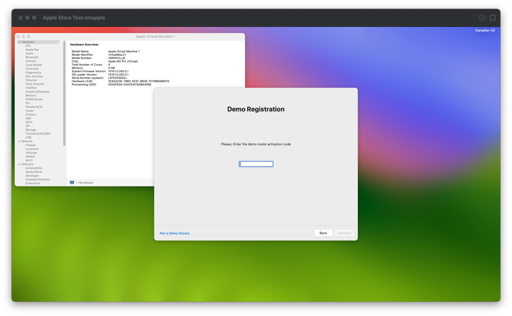

With my [last post](https://khronokernel.github.io/macos/2023/08/08/AS-VM.html), I briefly mentioned at the end that my next challenge was to figure out whether the usage of custom serial numbers or [Automated Device Enrolment (ADE)](https://support.apple.com/en-us/HT204142) through the [Device Enrolment Program (DEP)](https://www.apple.com/mx/business-docs/DEP_Guide.pdf) was possible on Apple Silicon VMs running macOS. Well today we'll go over the challenges of getting DEP working, and how iCloud and Custom Kernel Collections all face the same issue.

--------------

* [Reversing the Virtualization stack](#reversing-the-virtualization-stack)
* [Modding VirtualApple to gain more private functions](#modding-virtualapple-to-gain-more-private-functions)
* [Granting Private Entitlements](#granting-private-entitlements)
* [Booting our Virtual Machine with custom serial numbers](#booting-our-virtual-machine-with-custom-serial-numbers)
* [Secure Enclave: The Missing Piece](#secure-enclave-the-missing-piece)
* [iCloud, OS Betas and Kernel Collections](#icloud-os-betas-and-kernel-collections)
* [Conclusion](#conclusion)

## Reversing the Virtualization stack

To start, we'll be delving into Apple's Virtualization stack once more: `/System/Library/Frameworks/Virtualization.framework`.
What we'll be looking for is references to serial numbers in the framework, and whether there are any exposed methods to supplement our own values.

After a bit of searching, class dumps and a [very useful page from the vz wiki](https://github.com/Code-Hex/vz/wiki/Private-API-on-macOS-13), we can see some interesting properties and methods exposed in Virtualization.framework:

```objc
// Property
@property (T@"_VZMacSerialNumber",R) _serialNumber

// Class Method
[VZMacMachineIdentifier _machineIdentifierWithSerialNumber:]
```

| `_VZMacSerialNumber` | `_machineIdentifierWithSerialNumber` |
| :------------------- | :----------------------------------- |
|  |  |

Notes:

* Virtualization.framework currently only supports serial numbers of 10 characters. This means serial numbers from pre-2021, such as Intel machines and first-wave M1s, will be unsupported. Models released after the 2021 M1 iMac should be using this new format (ex. 14"/16" MacBook Pros)
  * Reference: [Apple Begins Transition to Randomized Serial Numbers With Purple iPhone 12](https://www.macrumors.com/2021/05/05/purple-iphone-12-randomized-serial-number/)
* These private APIs were added in macOS Ventura, thus requiring Ventura or newer as the host. However, Monterey guest VMs can still be used with them.

## Modding VirtualApple to gain more private functions

Now that we have these fun new APIs to try, we need an app we can modify. For this, we'll be modding [Saagar Jha's VirtualApple project](https://github.com//VirtualApple). With some help from [DhinakG](https://github.com/dhinakg), we're all set to test our VM!

* [DhinakG's fork of VirtualApple](https://github.com/dhinakg/VirtualApple)

However, on Virtual Machine creation, we get an unfortunate error when trying to start a Virtual Machine with a custom serial number:


## Granting Private Entitlements

After some brief debugging, I found that `com.apple.Virtualization.VirtualMachine.xpc` is dying with the following line:

> FATAL: Unable to create a virtual machine with restricted devices.


Throwing the XPC service in a decompiler, we find our issue:

```c
if (os_variant_has_internal_content("com.apple.virtualization") != 0x0) {
        sub_10024efa8("Restricted devices require the com.apple.private.virtualization entitlement.");
}
```


To resolve this, we'll need to sign VirtualApple with a private entitlement. Unfortunately for us, that means we need to disable AMFI.

As we did in the [last blog post](https://khronokernel.github.io/macos/2023/08/08/AS-VM.html), [boot into recoveryOS](https://support.apple.com/en-ca/guide/mac-help/mchl82829c17/mac) and run the following in Terminal:

```
bputil --disable-boot-args-restriction
nvram 40A0DDD2-77F8-4392-B4A3-1E7304206516:boot-args='amfi=0x80'
```

`amfi=0x80` is a boot argument that disables AMFI's security restrictions, including allowing us to sign arbitrary entitlements on our applications.
* This boot-arg is also known as `amfi_get_out_of_my_way=0x1`


----------

Once back in our main OS, we'll need to add the following entitlement: `com.apple.private.virtualization`

Simply add it to VirtualApple's entitlements.plist, and resign:

* You can also simply re-run the project with the updated entitlement if you don't have an exported app.

```
codesign -f -s - --entitlements entitlements.plist VirtualApple.app
```


## Booting our Virtual Machine with custom serial numbers

Finally, we can boot our virtual machine with our custom serial! After a brief install using an Apple Store serial number, we see some success! Our machine successfully appears as an Apple Demo Unit with the expected "Demo Registration: Please, Enter the demo mode activation code" message:

* Apple Store Serial Number: `LR7KD0GXQJ`



Now for the real challenge, testing a serial number enrolled in DEP.

-----------

Now for this test I'll grab a 10 character serial number off eBay and see if we can enroll in that machine's MDM.

* eBay MDM Locked Serial Number: `H49GVCG7G7`
  * [eBay MDM Locked 2022 MacBook Air](https://www.ebay.ca/itm/285419925510)

While install and initial setup went smoothly, we do hit a serious error:

```
An error occurred while obtaining automatic configuration settings
The cloud configuration server is unavailable
```


No matter the OS or the serial number, we keep hitting this activation error...


## Secure Enclave: The Missing Piece

After delving quite deep into the MDM enrolment flow, I found our core issue seems to be a missing `UCRT.pem`.
```
mobileactivationd: [com.apple.mobileactivationd:daemon] UCRT DEP enrollment state requested by mdmclient
mdmclient: [com.apple.ManagedClient:MDMDaemon] [0:MDMDaemon:<0x540>] UCRTsmb5: DEP registered according to UCRT: UCRTDEPStateUnavailable
mdmclient: [com.apple.ManagedClient:MDMDaemon] [0:MDMDaemon:<0x540>] CloudConfiguration: isDeviceRegisteredWithDEP:  APNS: -1  UCRT: -1  ProvDEP: 0
```

A UCRT is a User Identity Certificate that's sent from Apple's servers after our machine generates an attestation from the SEP (Secure Enclave Processor) using CryptoTokenKit.

* `/usr/libexec/teslad` requests the UCRT from Apple through `-[MobileActivationMacOSDaemon issueUCRT:withCompletionBlock:]_block_invoke`, the request will result in `Server error: 400 (bad request)` and thus the rest of the DEP chain will fail.
  * Reference: [LocalPolicy signing-key creation and management](https://support.apple.com/en-ca/guide/security/sec1f90fbad1/web)

So why does our Virtual Machine fail to create a UCRT? Well unfortunately it seems to be caused by missing hardware, specifically a lack of a Secure Enclave in our virtual machine. During attestation, the Owner Identity Certificate (OIC) is requested from the Secure Enclave, however our Virtual Machine doesn't support this and errors:

```
mobileactivationd: (libbootpolicy.dylib) [com.apple.BootPolicy:Library] BootPolicy: bootpolicy_get_oic: entry
mobileactivationd: (libbootpolicy.dylib) [com.apple.BootPolicy:Library] BootPolicy: SEP command 38 returned 3
mobileactivationd: (libbootpolicy.dylib) [com.apple.BootPolicy:Library] BootPolicy: assert: bpe == 0  (/AppleInternal/Library/BuildRoots/8ca92091-1d5a-11ee-a938-46d450270006/Library/Caches/com.apple.xbs/Sources/BootPolicy/dylib/dylib.c:1942)
mobileactivationd: (libbootpolicy.dylib) [com.apple.BootPolicy:Library] BootPolicy: bootpolicy_get_oic: exit: SEP storage (3)
```

Thus a proper attestation cannot be performed, and so the UCRT request fails.

----------

So how does the rest of the OS function when there's no SEP? Well Apple developed `AppleVPBootPolicy.kext`, `AppleVPCredentialManager.kext` and `AppleVPKeyStore.kext` to handle the missing SEP and trick most of the OS into functioning correctly. Though as we can see, it's not perfect and fails to handle our Attestation request.

If we reverse `/usr/lib/libbootpolicy.dylib` and examine `bootpolicy_get_oic`, we'll see a invocation to the SEP:
```c
int _bootpolicy_get_oic(int arg0, int arg1) {
	...
	result = __sep_command(0x26, ..., ..., ..., 0x1024);
}
```


From this, `__sep_command` invokes `__sep_send`, which implements an IOConnectCall for communication with `com.apple.security.BootPolicy` in IOService
* Normally `com.apple.security.BootPolicy` would be `BootPolicy.kext` on bare metal, however in VMs `AppleVPBootPolicy.kext` will be taking this role.

Inside of `AppleVPBootPolicy.kext`, the array `_command_functions[]`'s entries corresponds to different functions. 
```
SEP command 38 = _command_get_oic()
```

However the contents of this function doesn't provide anything of use, instead always returning error code 3:
```c
signed __int64 _command_get_oic()
{
  __asm { HINT            #0x22 }
  return 3LL;
}
```
* [`HINT #0x22`](https://developer.arm.com/documentation/ddi0596/2020-12/Base-Instructions/HINT--Hint-instruction-) translates to `0010 001`, which represents [Profiling Synchronization Barrier (`PSB`)](https://developer.arm.com/documentation/dui0801/h/A64-General-Instructions/PSB).
  * Thanks [Flagers](https://github.com/flagersgit) for the tip


It seems that OIC handling was never implemented, most likely `#ifdef`'d out of public versions.

## iCloud, OS Betas and Kernel Collections

Another thing you may have noticed is that Apple Silicon Virtual Machines cannot sign into iCloud. Well the reason for this is also attestation related, since AuthKit.framework cannot setup a secure chain of trust. And guess what macOS 13.4 added? A new requirement for [developer accounts to access macOS Betas](https://www.macrumors.com/2023/04/11/macos-ventura-watchos-beta-installation-change/).

And for those needing to boot development kernels or test kernel extensions are also out of luck, as it seems `bputil`/`kmutil` cannot communicate with the SEP to configure boot for custom Kernel Collections including Auxiliary KCs meant for kexts in `/Library/Extensions`.

* Steven Michaud has a thread in UTM's repo on their research into custom Kernel Collections:
  * [Cannot load 3rd party kexts #4026](https://github.com/utmapp/UTM/issues/4026)

## Conclusion

While unfortunately this research journey didn't result in any real successes for testing DEP workflows at work, it was still really interesting seeing how the enrolment setup functions as well as work with the private APIs in Virtualization.framework. Though it is quite frustrating seeing many development tools being unavailable in Virtual Machines, especially proper OS betas and custom kernel collections.

* Some partial work-arounds available however:
  * [vma2pwn](https://github.com/nick-botticelli/vma2pwn)
  * [Enabling macOS 14 beta updates in a virtual machine](https://github.com/insidegui/VirtualBuddy/discussions/194#discussioncomment-6406771)

Perhaps with macOS 15, we'll finally get `VirtualMac3,1` and proper SEP virtualization. Though this is just wishful thinking ;p


